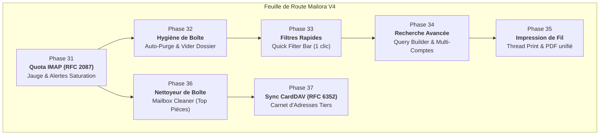

# Audit HelloMail (Mailora) V4 — Stockage RFC 2087, Hygiène de Boîte & Expérience Pro

> **Date :** 12 septembre 2026  
> **Périmètre :** Monorepo `Mailora/` (backend Express + sync worker + frontend Next.js 16)  
> **Socle actuel :** 30 Phases livrées à 100% — **1015 tests automatisés Vitest 100% verts** (710 backend + 305 frontend), 0 `as any`, typage TypeScript strict.  
> **Archives :** Les audits précédents ([AUDIT.md](file:///mnt/Externe/Projets/HelloMail/audits_implemented/AUDIT.md) couvrant V1, [AUDITV2.md](file:///mnt/Externe/Projets/HelloMail/audits_implemented/AUDITV2.md) couvrant V2, et [AUDITV3.md](file:///mnt/Externe/Projets/HelloMail/audits_implemented/AUDITV3.md) couvrant V3) sont archivés dans `audits_implemented/`.

---

## Sommaire

1. [Résumé exécutif & Bilan des Phases 1 à 30](#1-résumé-exécutif--bilan-des-phases-1-à-30)
2. [Audit de code approfondi : Détections, Faiblesses latentes & Opportunités architecturales](#2-audit-de-code-approfondi--détections-faiblesses-latentes--opportunités-architecturales)
   - [2.1 Absence critique de gestion du Quota IMAP (RFC 2087) et détection de saturation de boîte](#21-absence-critique-de-gestion-du-quota-imap-rfc-2087-et-détection-de-saturation-de-boîte)
   - [2.2 Inexistence d'action « Vider le dossier » (Empty Trash / Spam) et absence de politique d'auto-purge de rétention](#22-inexistence-daction-«-vider-le-dossier-»-empty-trash--spam-et-absence-de-politique-dauto-purge-de-rétention)
   - [2.3 Manque d'ergonomie dans la liste de messages : Absence de filtres rapides en 1 clic (« Quick Filter Bar »)](#23-manque-dergonomie-dans-la-liste-de-messages--absence-de-filtres-rapides-en-1-clic-«-quick-filter-bar-»)
   - [2.4 Lacune de recherche : Absence de constructeur visuel multi-critères et cloisonnement mono-compte dans le Spotlight](#24-lacune-de-recherche--absence-de-constructeur-visuel-multi-critères-et-cloisonnement-mono-compte-dans-le-spotlight)
   - [2.5 Limitation d'impression : Tronquage du fil de discussion en vue conversation (@media print incomplet)](#25-limitation-dimpression--tronquage-du-fil-de-discussion-en-vue-conversation-media-print-incomplet)
   - [2.6 Optimiseur de stockage & Nettoyeur intelligent de boîte mail (« Mailbox Cleaner »)](#26-optimiseur-de-stockage--nettoyeur-intelligent-de-boîte-mail-«-mailbox-cleaner-»)
   - [2.7 Isolation des contacts : Absence de synchronisation bidirectionnelle CardDAV (RFC 6352)](#27-isolation-des-contacts--absence-de-synchronisation-bidirectionnelle-carddav-rfc-6352)
   - [2.8 Dépassement de seuil de taille de fichier : messageActionService.ts (493 lignes) et initialSync.ts (420 lignes)](#28-dépassement-de-seuil-de-taille-de-fichier--messageactionservicets-493-lignes-et-initialsyncts-420-lignes)
3. [Feuille de route V4 — Planification par Phases (Phases 31 à 37)](#3-feuille-de-route-v4--planification-par-phases-phases-31-à-37)
   - [Phase 31 — Gestion du Quota IMAP (RFC 2087), Alertes de Saturation & Jauge de Stockage](#phase-31--gestion-du-quota-imap-rfc-2087-alertes-de-saturation--jauge-de-stockage)
   - [Phase 32 — Hygiène de Boîte : Purge Automatique (Trash & Spam) & Action « Vider le dossier » en 1 clic](#phase-32--hygiène-de-boîte--purge-automatique-trash--spam--action-«-vider-le-dossier-»-en-1-clic)
   - [Phase 33 — Filtres Rapides (« Quick Filter Bar ») dans la Liste de Messages](#phase-33--filtres-rapides-«-quick-filter-bar-»-dans-la-liste-de-messages)
   - [Phase 34 — Recherche Avancée Visuelle Multi-Critères (Query Builder) & Recherche Multi-Comptes Fédérée](#phase-34--recherche-avancée-visuelle-multi-critères-query-builder--recherche-multi-comptes-fédérée)
   - [Phase 35 — Impression & Export PDF Unifié de Fil de Discussion (Thread Print)](#phase-35--impression--export-pdf-unifié-de-fil-de-discussion-thread-print)
   - [Phase 36 — Optimiseur de Stockage & Nettoyeur Intelligent (« Mailbox Cleaner »)](#phase-36--optimiseur-de-stockage--nettoyeur-intelligent-«-mailbox-cleaner-»)
   - [Phase 37 — Synchronisation des Contacts Externes via CardDAV (RFC 6352)](#phase-37--synchronisation-des-contacts-externes-via-carddav-rfc-6352)
4. [Matrice des Priorités, Risques et Impacts](#4-matrice-des-priorités-risques-et-impacts)

---

## 1. Résumé exécutif & Bilan des Phases 1 à 30

**HelloMail / Mailora** a franchi avec succès les trois premiers grands jalons de son développement :
- **V1 (Phases 1 à 17)** : Les fondations indispensables d'un client de messagerie contemporain (auth JWT/Passkeys, multi-comptes IMAP/SMTP, sync temps réel SSE, threading conversationnel, chiffrement OpenPGP, import/export EML et vCard/CSV, dossiers unifiés, programmation d'envoi et multi-identités).
- **V2 (Phases 18 à 22)** : L'interopérabilité et la sécurité avancée (invitations iCalendar RFC 5545 avec RSVP, badges de conformité SPF/DKIM/DMARC, dossiers intelligents dynamiques, signatures contextuelles avec variables, et PWA avec résilience hors-ligne IndexedDB).
- **V3 (Phases 23 à 30)** : Le durcissement systémique, la collaboration et la souveraineté des données (durcissement anti-ReDoS et gardes-fous OAuth, hub de synchronisation multi-onglets BroadcastChannel, visualiseur multimédia Lightbox, détection intelligente de relances Follow-Up, gestes tactiles swipe et densité réglable, réponses intelligentes heuristiques et détection d'oubli de pièces jointes, export complet en streaming MBOX/ZIP, et sauvegarde/restauration chiffrée de profil utilisateur PBKDF2/AES-256-GCM).

Le système se caractérise par :
- **1015 tests automatisés Vitest 100% verts** (710 côté backend, 305 côté frontend sur 153 fichiers de tests).
- **Zéro dette de typage** : 0 `as any` sur l'ensemble du monorepo, typage TypeScript strict, double vérification `tsc --noEmit` irréprochable.
- **Architecture bi-process robuste** : API Express d'un côté, sync worker avec verrous distribués Redis `SET NX PX` et heartbeat de l'autre.

L'objet de cet **Audit V4** est d'élever Mailora au niveau des meilleurs clients de messagerie professionnels du marché (Thunderbird, Superhuman, Apple Mail et Proton Mail) en s'attaquant aux trois dimensions clés :
1. **La gestion de la capacité & du stockage** : Quota IMAP RFC 2087, alertes de saturation préventives, hygiène de boîte et optimiseur d'espace.
2. **L'efficacité opérationnelle & l'expérience utilisateur** : Filtres rapides par chips en un clic, constructeur de recherche visuel multi-critères, recherche fédérée tous comptes, et impression intégrale de fil de discussion.
3. **L'interopérabilité des données distantes** : Synchronisation continue CardDAV (RFC 6352) pour les carnets d'adresses d'entreprise et personnels.



---

## 2. Audit de code approfondi : Détections, Faiblesses latentes & Opportunités architecturales

### 2.1 Absence critique de gestion du Quota IMAP (RFC 2087) et détection de saturation de boîte
- **Fichiers impactés :**
  - [`backend/src/models/Account.ts`](file:///mnt/Externe/Projets/HelloMail/backend/src/models/Account.ts)
  - [`backend/src/services/email/imapPool.ts`](file:///mnt/Externe/Projets/HelloMail/backend/src/services/email/imapPool.ts)
  - [`backend/src/services/sync/initialSync.ts`](file:///mnt/Externe/Projets/HelloMail/backend/src/services/sync/initialSync.ts)
  - [`frontend/src/components/mail/AccountSidebar.tsx`](file:///mnt/Externe/Projets/HelloMail/frontend/src/components/mail/AccountSidebar.tsx)
- **Diagnostic :**
  Bien que la bibliothèque sous-jacente `imapflow` supporte nativement l'appel `client.getQuota()` (implémentant l'extension standard IMAP4 RFC 2087 `QUOTA` / `GETQUOTAROOT`), **aucun module de l'application n'interroge ni n'expose les quotas de stockage du compte**.
  1. L'utilisateur n'a aucune indication visuelle de son taux d'occupation (ex : Gmail 15 Go, OVH 5 Go, Infomaniak 20 Go, Dovecot d'entreprise 2 Go).
  2. Lorsqu'une boîte sature (> 99%), les serveurs IMAP et SMTP réagissent par des rejets brutaux (`552 5.2.2 Mailbox is full`, `[OVERQUOTA] Quota exceeded`), ce qui se traduit par des erreurs HTTP 422 ou 500 opaques lors de la sauvegarde de brouillons ou de l'envoi d'emails.
  3. L'absence de télémétrie de quota empêche toute politique préventive d'alerte (seuil d'avertissement à 80%, seuil critique à 95%).
- **Solution recommandée :**
  1. Créer le service [`backend/src/services/email/imapQuotaService.ts`](file:///mnt/Externe/Projets/HelloMail/backend/src/services/email/imapQuotaService.ts) qui appelle `client.getQuota()` (ou `client.getQuotaRoot()`) avec repli gracieux (`null` si non supporté par le serveur IMAP).
  2. Persister l'état dans [`AccountModel`](file:///mnt/Externe/Projets/HelloMail/backend/src/models/Account.ts) sous le champ `storageQuota: { usedBytes: number, totalBytes: number, updatedAt: Date }` rafraîchi lors des synchronisations initiales ou sur requête.
  3. Exposer l'endpoint REST dédié `GET /api/accounts/:accountId/quota`.
  4. Intégrer un composant discret de jauge de stockage `StorageQuotaBar.tsx` dans le pied de barre latérale de chaque compte dans [`AccountSidebar.tsx`](file:///mnt/Externe/Projets/HelloMail/frontend/src/components/mail/AccountSidebar.tsx).

---

### 2.2 Inexistence d'action « Vider le dossier » (Empty Trash / Spam) et absence de politique d'auto-purge de rétention
- **Fichiers impactés :**
  - [`backend/src/controllers/foldersController.ts`](file:///mnt/Externe/Projets/HelloMail/backend/src/controllers/foldersController.ts#L50-L60)
  - [`backend/src/services/email/folderService.ts`](file:///mnt/Externe/Projets/HelloMail/backend/src/services/email/folderService.ts#L260-L270)
  - [`backend/src/services/email/folderProtection.ts`](file:///mnt/Externe/Projets/HelloMail/backend/src/services/email/folderProtection.ts#L43-L53)
  - [`frontend/src/components/mail/MessageListHeader.tsx`](file:///mnt/Externe/Projets/HelloMail/frontend/src/components/mail/MessageListHeader.tsx)
  - [`frontend/src/components/mail/folders/FolderContextMenu.tsx`](file:///mnt/Externe/Projets/HelloMail/frontend/src/components/mail/folders/FolderContextMenu.tsx)
- **Diagnostic :**
  1. Dans [`folderProtection.ts`](file:///mnt/Externe/Projets/HelloMail/backend/src/services/email/folderProtection.ts), les dossiers système (Trash, Junk, Inbox, Sent, Drafts) sont protégés contre la suppression ou le renommage (`isProtectedFolder`). Mais **il n'existe aucune méthode pour vider le contenu d'un dossier**.
  2. Pour purger la Corbeille ou les Courriers Indésirables, l'utilisateur est contraint de cocher manuellement les messages par lot de 50 (taille de page) et de cliquer sur "Supprimer définitivement". Pour un dossier de 3000 messages, cette manipulation doit être répétée 60 fois !
  3. De plus, aucune tâche de fond automatique ne nettoie les messages de la Corbeille ou des Spams de plus de 30 jours (standard universel de tous les webmails modernes), ce qui entraîne une rétention inutile et une augmentation constante de l'espace disque MongoDB et serveur.
- **Solution recommandée :**
  1. Développer l'action `emptyFolder(account, folderPath)` dans [`folderService.ts`](file:///mnt/Externe/Projets/HelloMail/backend/src/services/email/folderService.ts) :
     - Envoi de la commande IMAP `messageDelete('1:*', { uid: true })` ou marquage `\Deleted` + `client.mailboxExpunge()`.
     - Purge atomique dans [`MessageModel`](file:///mnt/Externe/Projets/HelloMail/backend/src/models/Message.ts) et [`MessageBodyModel`](file:///mnt/Externe/Projets/HelloMail/backend/src/models/MessageBody.ts).
     - Réinitialisation des compteurs de dossier à 0.
  2. Ajouter la route REST `POST /api/accounts/:accountId/folders/:folder/empty` sécurisée aux seuls dossiers autorisés (`Trash` et `Junk`).
  3. Implémenter le runner d'auto-purge `autoPurgeRunner.ts` dans le sync worker ([`backend/src/worker.ts`](file:///mnt/Externe/Projets/HelloMail/backend/src/worker.ts)) paramétrable dans les préférences utilisateur (`retentionTrashDays: 30`, `retentionJunkDays: 30`).
  4. Ajouter le bouton d'action contextuelle "Vider la corbeille" / "Vider les spams" dans [`MessageListHeader.tsx`](file:///mnt/Externe/Projets/HelloMail/frontend/src/components/mail/MessageListHeader.tsx) et [`FolderContextMenu.tsx`](file:///mnt/Externe/Projets/HelloMail/frontend/src/components/mail/folders/FolderContextMenu.tsx) avec modale de confirmation `EmptyFolderDialog.tsx`.

---

### 2.3 Manque d'ergonomie dans la liste de messages : Absence de filtres rapides en 1 clic (« Quick Filter Bar »)
- **Fichiers impactés :**
  - [`frontend/src/components/mail/MessageListHeader.tsx`](file:///mnt/Externe/Projets/HelloMail/frontend/src/components/mail/MessageListHeader.tsx#L28-L74)
  - [`frontend/src/components/mail/MessageList.tsx`](file:///mnt/Externe/Projets/HelloMail/frontend/src/components/mail/MessageList.tsx)
  - [`frontend/src/lib/stores/uiStore.ts`](file:///mnt/Externe/Projets/HelloMail/frontend/src/lib/stores/uiStore.ts)
- **Diagnostic :**
  L'en-tête [`MessageListHeader.tsx`](file:///mnt/Externe/Projets/HelloMail/frontend/src/components/mail/MessageListHeader.tsx) ne propose actuellement que le champ textuel `SearchBar` et le sélecteur de densité.
  Pour isoler les messages non lus ou les messages avec pièces jointes au sein d'une boîte de 1000 messages, l'utilisateur doit obligatoirement écrire au clavier `is:unread` ou `has:attachment` dans la barre de recherche.
  Dans Thunderbird ou Superhuman, une barre de filtres rapides en un clic permet d'activer instantanément des chips :
  - **Non lus** (`Unread`)
  - **Épinglés** (`Pinned`)
  - **Étoilés** (`Flagged`)
  - **Avec pièces jointes** (`Attachments`)
  - **Période** (`Aujourd'hui`, `Cette semaine`)
- **Solution recommandée :**
  1. Créer le composant `QuickFilterBar.tsx` intégré directement sous le titre du dossier dans [`MessageListHeader.tsx`](file:///mnt/Externe/Projets/HelloMail/frontend/src/components/mail/MessageListHeader.tsx).
  2. Brancher ces filtres directement sur les paramètres de requête de liste (`useMessages(accountId, folder, { filter: 'unread' | 'pinned' | 'flagged' | 'attachments' })`).
  3. Offrir les raccourcis clavier rapides (ex: touche `U` pour basculer le filtre non-lu, `S` pour important) quand le focus est sur la liste.

---

### 2.4 Lacune de recherche : Absence de constructeur visuel multi-critères et cloisonnement mono-compte dans le Spotlight
- **Fichiers impactés :**
  - [`backend/src/services/email/searchService.ts`](file:///mnt/Externe/Projets/HelloMail/backend/src/services/email/searchService.ts#L45-L60)
  - [`frontend/src/components/mail/GlobalSearchDialog.tsx`](file:///mnt/Externe/Projets/HelloMail/frontend/src/components/mail/GlobalSearchDialog.tsx#L39-L42)
  - [`frontend/src/components/mail/SearchBar.tsx`](file:///mnt/Externe/Projets/HelloMail/frontend/src/components/mail/SearchBar.tsx)
- **Diagnostic :**
  1. Dans [`GlobalSearchDialog.tsx`](file:///mnt/Externe/Projets/HelloMail/frontend/src/components/mail/GlobalSearchDialog.tsx#L40), la recherche globale est restreinte au compte actif ou au premier compte trouvé : `effectiveAccountId = activeAccountId || selectedAccountId || accounts?.[0]?._id || ""`. Si un utilisateur possède 3 comptes email, le dialogue de recherche Cmd+K est incapable de rechercher simultanément dans l'ensemble de ses boîtes !
  2. La formulation de filtres avancés (expéditeur, sujet, dates, pièces jointes) impose de mémoriser et taper une syntaxe précise (`from:`, `since:`, `before:`, `has:attachment`).
  3. Il n'existe pas d'interface graphique de construction de requêtes (Query Builder) avec champs dédiés (De, À, Objet, Plage de dates avec DatePicker, Taille minimum en Mo, Dossier cible).
- **Solution recommandée :**
  1. Créer l'endpoint de recherche unifiée multi-comptes `GET /api/unified/search` côté backend, s'appuyant sur les index composés déjà existants.
  2. Concevoir le panneau dépliable `AdvancedSearchBuilder.tsx` au sein de [`GlobalSearchDialog.tsx`](file:///mnt/Externe/Projets/HelloMail/frontend/src/components/mail/GlobalSearchDialog.tsx) et [`SearchBar.tsx`](file:///mnt/Externe/Projets/HelloMail/frontend/src/components/mail/SearchBar.tsx).
  3. Ajouter un sélecteur "Compte : Tous les comptes / Compte spécifique" et un bouton direct "Sauvegarder en tant que Dossier Intelligent".

---

### 2.5 Limitation d'impression : Tronquage du fil de discussion en vue conversation (@media print incomplet)
- **Fichiers impactés :**
  - [`frontend/src/components/mail/MessageThreadView.tsx`](file:///mnt/Externe/Projets/HelloMail/frontend/src/components/mail/MessageThreadView.tsx#L26)
  - [`frontend/src/components/mail/MessageReader.tsx`](file:///mnt/Externe/Projets/HelloMail/frontend/src/components/mail/MessageReader.tsx#L170-L175)
  - [`frontend/src/app/globals.css`](file:///mnt/Externe/Projets/HelloMail/frontend/src/app/globals.css#L359-L380)
- **Diagnostic :**
  À la ligne 26 de [`MessageThreadView.tsx`](file:///mnt/Externe/Projets/HelloMail/frontend/src/components/mail/MessageThreadView.tsx#L26), la classe `no-print` masque intégralement la timeline de conversation lors de l'impression :
  ```tsx
  <div className="border-b border-border bg-muted/20 px-4 py-2 no-print select-none">
  ```
  Conséquence : lorsqu'un utilisateur déclenche l'impression (raccourci `P`, Ctrl+P ou bouton Imprimer), seul le message individuel actif est imprimé.
  Dans un contexte juridique, administratif ou commercial, un utilisateur a besoin d'imprimer ou d'exporter en PDF **l'intégralité du fil de discussion** dans son ordre chronologique, avec des en-têtes compacts et le repli automatique des citations répétées (`> >`) pour éviter de gâcher des dizaines de pages de papier.
- **Solution recommandée :**
  1. Ajouter un bouton explicite "Imprimer toute la conversation" dans [`MessageThreadView.tsx`](file:///mnt/Externe/Projets/HelloMail/frontend/src/components/mail/MessageThreadView.tsx) et [`MessageToolbar.tsx`](file:///mnt/Externe/Projets/HelloMail/frontend/src/components/mail/MessageToolbar.tsx).
  2. Adapter les règles CSS `@media print` dans [`globals.css`](file:///mnt/Externe/Projets/HelloMail/frontend/src/app/globals.css) pour dérouler et afficher tous les messages de la conversation avec séparateurs clairs et sauts de page contrôlés (`page-break-inside: avoid`).
  3. Masquer intelligemment les blocs de citation répétés lors de l'impression (`.printable-area blockquote { display: none; }` avec mention discrète `[Citation masquée pour l'impression]`).

---

### 2.6 Optimiseur de stockage & Nettoyeur intelligent de boîte mail (« Mailbox Cleaner »)
- **Fichiers impactés :**
  - [`backend/src/models/Message.ts`](file:///mnt/Externe/Projets/HelloMail/backend/src/models/Message.ts)
  - Nouveau : `backend/src/services/email/mailboxCleanerService.ts`
  - Nouveau : `backend/src/controllers/mailboxCleanerController.ts`
  - Nouveau : `frontend/src/components/mail/settings/MailboxCleanerDialog.tsx`
- **Diagnostic :**
  Quand le quota approche de la saturation (ex: 95%), l'utilisateur est démuni : il ne sait pas quels messages occupent le plus de place.
  Généralement, 80% de l'espace d'une boîte est consommé par moins de 5% des emails (gros fichiers PDF, vidéos, archives ZIP reçues il y a plusieurs années).
  MongoDB contient déjà la taille exacte de chaque message (`size: number`) et le flag `hasAttachments`. Cependant, aucun endpoint d'agrégation n'exploite ces données pour aider l'utilisateur à faire du ménage.
- **Solution recommandée :**
  1. Développer l'endpoint d'analyse `GET /api/accounts/:accountId/cleaner/analysis` :
     - Top 50 des emails les plus volumineux (> 10 Mo, > 5 Mo).
     - Répartition du volume par dossier (Inbox, Sent, Archive, Trash).
     - Top des expéditeurs les plus volumineux / newsletters inactives.
  2. Offrir des actions de nettoyage en lot sécurisées :
     - Téléchargement de l'archive EML/ZIP avant suppression.
     - Suppression définitive ou déplacement vers la Corbeille des messages sélectionnés.
  3. Dialogue frontend interactif `MailboxCleanerDialog.tsx` accessible depuis la jauge de stockage ou les paramètres du compte.

---

### 2.7 Isolation des contacts : Absence de synchronisation bidirectionnelle CardDAV (RFC 6352)
- **Fichiers impactés :**
  - [`backend/src/models/Contact.ts`](file:///mnt/Externe/Projets/HelloMail/backend/src/models/Contact.ts)
  - [`backend/src/services/contacts/contactService.ts`](file:///mnt/Externe/Projets/HelloMail/backend/src/services/contacts/contactService.ts)
  - [`backend/src/services/contacts/contactImportExportService.ts`](file:///mnt/Externe/Projets/HelloMail/backend/src/services/contacts/contactImportExportService.ts)
  - [`frontend/src/components/auth/ContactsManager.tsx`](file:///mnt/Externe/Projets/HelloMail/frontend/src/components/auth/ContactsManager.tsx)
- **Diagnostic :**
  HelloMail dispose d'un carnet d'adresses complet et supporte l'import/export manuel au format vCard (.vcf) et CSV (livré en Phase 11).
  Cependant, les utilisateurs modernes synchronisent leurs contacts de smartphone (iOS, Android) via **CardDAV** (Nextcloud, Google Contacts, Fastmail, Apple iCloud, Baïkal, Synology).
  Aujourd'hui, si un utilisateur ajoute un contact dans son téléphone, il doit ré-exporter un fichier vCard manuellement pour l'importer dans HelloMail.
- **Solution recommandée :**
  1. Modéliser les comptes CardDAV : `CardDavAccount` (URL du serveur, login, mot de passe chiffré AES-256-GCM, `syncToken`).
  2. Implémenter le client WebDAV/CardDAV natif en Node.js ESM (`PROPFIND`, `REPORT addressbook-multiget`, RFC 6352 & RFC 6578 sync-collection).
  3. Mettre en place un runner de synchronisation incrémentale bidirectionnelle avec déduplication par adresse email.
  4. Panneau de configuration CardDAV dans [`ContactsManager.tsx`](file:///mnt/Externe/Projets/HelloMail/frontend/src/components/auth/ContactsManager.tsx).

---

### 2.8 Dépassement de seuil de taille de fichier : messageActionService.ts (493 lignes) et initialSync.ts (420 lignes)
- **Fichiers impactés :**
  - [`backend/src/services/email/messageActionService.ts`](file:///mnt/Externe/Projets/HelloMail/backend/src/services/email/messageActionService.ts) (493 lignes)
  - [`backend/src/services/sync/initialSync.ts`](file:///mnt/Externe/Projets/HelloMail/backend/src/services/sync/initialSync.ts) (420 lignes)
- **Diagnostic :**
  La convention du projet fixe une limite stricte de **300 lignes par fichier** (350 lignes tolérées si indivisible).
  - [`messageActionService.ts`](file:///mnt/Externe/Projets/HelloMail/backend/src/services/email/messageActionService.ts) cumule la gestion des flags individuels (`seen`, `flagged`, `answered`), la résolution des chemins spéciaux (Trash/Junk), les déplacements, suppressions et l'orchestration des batchs.
  - [`initialSync.ts`](file:///mnt/Externe/Projets/HelloMail/backend/src/services/sync/initialSync.ts) regroupe la synchronisation unitaire par range de séquence, l'orchestration globale multi-dossiers et la purge des alias localisés d'INBOX.
- **Solution recommandée :**
  - Extraire les actions de flags et d'épinglage dans `messageFlagsService.ts` et les batchs dans `messageBatchService.ts`.
  - Extraire l'orchestration multi-dossiers et la purge d'alias dans `syncOrchestrator.ts`.
  - Rétablir les deux fichiers sous la barre des 250 lignes sans changer leur API publique.

---

## 3. Feuille de route V4 — Planification par Phases (Phases 31 à 37)

### Phase 31 — Gestion du Quota IMAP (RFC 2087), Alertes de Saturation & Jauge de Stockage (LIVRÉE ✅)
**Priorité : 🔴 CRITIQUE | Risque : Faible | Effort : Moyen | Statut : 100% LIVRÉE**
1. **Service Quota IMAP standardisé (RFC 2087)** :
   - Module [`backend/src/services/email/imapQuotaService.ts`](file:///mnt/Externe/Projets/HelloMail/backend/src/services/email/imapQuotaService.ts) interrogeant `client.getQuota()` sur la racine de stockage.
   - Cache TTL 15 minutes en base pour éviter de surcharger les serveurs IMAP à chaque rafraîchissement d'interface.
   - Détection des serveurs sans support `QUOTA` (fallback propre avec champ `supported: false`).
2. **Persistance & Endpoints REST** :
   - Enrichissement de [`AccountModel`](file:///mnt/Externe/Projets/HelloMail/backend/src/models/Account.ts) avec le sous-document `storageQuota: { usedBytes: number, totalBytes: number, updatedAt: Date }`.
   - Endpoint `GET /api/accounts/:accountId/quota` retournant les données formatées en octets et pourcentage.
3. **Interface utilisateur & Alertes proactives** :
   - Composant `StorageQuotaBar.tsx` intégré dans la barre latérale [`AccountSidebar.tsx`](file:///mnt/Externe/Projets/HelloMail/frontend/src/components/mail/AccountSidebar.tsx).
   - Couleurs dynamiques selon le niveau d'occupation : vert (< 75%), orange (75-90%), rouge pulsant (> 90%).
   - Toast d'avertissement préventif à la connexion si le quota dépasse 90%.
4. **Tests automatisés** :
   - Tests unitaires Vitest avec mocks de `client.getQuota()` (quota supporté, quota non supporté, dépassement).
   - Tests de composants React pour la jauge et les alertes.

---

### Phase 32 — Hygiène de Boîte : Purge Automatique (Trash & Spam) & Action « Vider le dossier » en 1 clic (LIVRÉE ✅)
**Priorité : 🔴 CRITIQUE | Risque : Faible | Effort : Moyen | Statut : 100% LIVRÉE**
1. **Action atomique de vidage de dossier (`emptyFolder`)** :
   - Méthode `emptyFolder(account, folderPath)` dans [`folderService.ts`](file:///mnt/Externe/Projets/HelloMail/backend/src/services/email/folderService.ts).
   - Envoi de la commande de suppression globale IMAP et appel `client.mailboxExpunge()`.
   - Purge synchronisée dans [`MessageModel`](file:///mnt/Externe/Projets/HelloMail/backend/src/models/Message.ts) et [`MessageBodyModel`](file:///mnt/Externe/Projets/HelloMail/backend/src/models/MessageBody.ts).
   - Sécurisation stricte : seuls les dossiers de type `Trash` et `Junk` peuvent être vidés via cette action (rejet 403 pour `INBOX`, `Sent`, `Drafts`).
2. **Runner d'auto-purge en arrière-plan dans le Worker** :
   - Tâche périodique quotidienne `autoPurgeRunner.ts` exécutée par le sync worker ([`backend/src/worker.ts`](file:///mnt/Externe/Projets/HelloMail/backend/src/worker.ts)).
   - Suppression automatique des messages dont `date` est antérieure au délai de rétention configuré (ex: 30 jours pour Corbeille et Spams).
   - Préférences utilisateurs configurables dans les réglages (`retentionTrashDays`, `retentionJunkDays`, `autoPurgeEnabled`).
3. **Interface utilisateur & Dialogue de confirmation** :
   - Dialogue sécurisé `EmptyFolderDialog.tsx` avec affichage du nombre exact de messages qui seront définitivement détruits.
   - Boutons d'accès rapide dans [`MessageListHeader.tsx`](file:///mnt/Externe/Projets/HelloMail/frontend/src/components/mail/MessageListHeader.tsx) et le menu contextuel [`FolderContextMenu.tsx`](file:///mnt/Externe/Projets/HelloMail/frontend/src/components/mail/folders/FolderContextMenu.tsx).
4. **Tests automatisés** :
   - Tests backend vérifiant le rejet des dossiers protégés non-poubelle et l'exécution de la purge.
   - Tests du runner d'auto-purge et des préférences.

---

### Phase 33 — Filtres Rapides (« Quick Filter Bar ») dans la Liste de Messages
**Priorité : 🟠 HAUTE | Risque : Nul | Effort : Faible**
1. **Composant QuickFilterBar ergonomique** :
   - Barre de chips interactifs positionnée sous l'en-tête de la liste de messages [`MessageListHeader.tsx`](file:///mnt/Externe/Projets/HelloMail/frontend/src/components/mail/MessageListHeader.tsx).
   - Chips : **Tous**, **Non lus** (`MailUnread`), **Épinglés** (`Pin`), **Importants** (`Star`), **Avec pièces jointes** (`Paperclip`).
2. **Intégration réactive & Raccourcis clavier** :
   - Filtrage instantané via Zustand [`uiStore.ts`](file:///mnt/Externe/Projets/HelloMail/frontend/src/lib/stores/uiStore.ts) ou paramètres d'URL, sans rechargement de page.
   - Raccourcis clavier rapides dédiés pour basculer les filtres sans utiliser la souris.
   - Badge de comptage dynamique sur chaque filtre indiquant le nombre de messages correspondants dans la vue courante.
3. **Tests automatisés** :
   - Tests unitaires et d'intégration frontend (Testing Library) vérifiant le filtrage en temps réel et la réactivité des chips.

---

### Phase 34 — Recherche Avancée Visuelle Multi-Critères (Query Builder) & Recherche Multi-Comptes Fédérée
**Priorité : 🟠 HAUTE | Risque : Faible | Effort : Moyen**
1. **Moteur de recherche unifiée multi-comptes** :
   - Endpoint `GET /api/unified/search` permettant d'interroger tous les comptes de l'utilisateur en une seule passe.
   - Respect des critères d'exclusion (ne pas inclure Trash et Spam par défaut dans la recherche unifiée).
2. **Constructeur visuel de filtres (Query Builder)** :
   - Volet dépliable `AdvancedSearchBuilder.tsx` accessible depuis [`GlobalSearchDialog.tsx`](file:///mnt/Externe/Projets/HelloMail/frontend/src/components/mail/GlobalSearchDialog.tsx) et [`SearchBar.tsx`](file:///mnt/Externe/Projets/HelloMail/frontend/src/components/mail/SearchBar.tsx).
   - Formulaire dédié avec champs : Expéditeur (`from`), Destinataire (`to`), Objet (`subject`), Période (`since` / `before` avec calendrier DatePicker), Pièces jointes (oui/non), Taille supérieure à X Mo, et Dossier cible.
3. **Passerelle vers les Dossiers Intelligents** :
   - Bouton en 1 clic : "Enregistrer cette recherche sous forme de dossier intelligent" (`SmartFolder`).
4. **Tests automatisés** :
   - Tests de l'endpoint de recherche unifiée et de la composition des filtres MongoDB.
   - Tests frontend du dialogue et du constructeur de requêtes.

---

### Phase 35 — Impression & Export PDF Unifié de Fil de Discussion (Thread Print)
**Priorité : 🟡 MOYENNE | Risque : Nul | Effort : Faible**
1. **Feuille de style d'impression complète de conversation** :
   - Révision de [`globals.css`](file:///mnt/Externe/Projets/HelloMail/frontend/src/app/globals.css) et de [`MessageThreadView.tsx`](file:///mnt/Externe/Projets/HelloMail/frontend/src/components/mail/MessageThreadView.tsx) pour autoriser l'impression du fil complet (`@media print`).
   - Mise en page optimisée pour le papier : en-têtes d'échange compacts, masquage des éléments de navigation, des boutons d'actions et des barres d'outils (`.no-print`).
2. **Gestion intelligente des citations & Rupture de page** :
   - Masquage automatique ou repli des blocs de citations récurrentes (`blockquote`) pour économiser l'encre et le papier.
   - Préservation des blocs atomiques (`page-break-inside: avoid`) pour éviter qu'un message ne soit coupé en deux au milieu d'une ligne.
3. **Actions utilisateur & Raccourcis** :
   - Bouton "Imprimer tout le fil" dans [`MessageToolbar.tsx`](file:///mnt/Externe/Projets/HelloMail/frontend/src/components/mail/MessageToolbar.tsx) et dans le menu contextuel.
   - Filigrane discret horodaté en pied de page : nom de la conversation, date d'impression, identité du compte.
4. **Tests automatisés** :
   - Tests frontend vérifiant la présence des classes print adéquates et le déclenchement du flux d'impression.

---

### Phase 36 — Optimiseur de Stockage & Nettoyeur Intelligent (« Mailbox Cleaner »)
**Priorité : 🟡 MOYENNE | Risque : Faible | Effort : Moyen**
1. **Service d'analyse de volumétrie (`mailboxCleanerService.ts`)** :
   - Requêtes d'agrégation MongoDB pour identifier les 50 messages les plus volumineux (`size: -1`).
   - Détection des expéditeurs de newsletters inactives ou automatisées à fort volume.
   - Calcul de la répartition de l'espace disque par dossier.
2. **Actions de remédiation assistées** :
   - Sélection multiple avec actions : "Télécharger les originaux puis supprimer", "Déplacer dans la Corbeille", "Supprimer définitivement".
   - Export ZIP de sécurité préalable en un clic via le service de streaming MBOX/ZIP livré en Phase 29.
3. **Interface utilisateur dédiée** :
   - Dialogue interactif `MailboxCleanerDialog.tsx` avec jauges graphiques, badges de taille (ex: `18.4 Mo`), et prévisualisation instantanée.
4. **Tests automatisés** :
   - Tests des pipelines d'agrégation MongoDB et des actions de suppression groupée.

---

### Phase 37 — Synchronisation des Contacts Externes via CardDAV (RFC 6352)
**Priorité : 🟢 ÉVOLUTIVE | Risque : Moyen | Effort : Élevé**
1. **Protocole CardDAV & Client WebDAV XML** :
   - Client Node.js ESM gérant l'authentification HTTP Basic/Bearer, `PROPFIND`, et `REPORT` (`addressbook-query`, `sync-collection` RFC 6578).
   - Parsing et sérialisation des cartes vCard 3.0 et 4.0 (RFC 6350).
2. **Synchronisation bidirectionnelle incrémentale** :
   - Gestion des jetons `sync-token` et des `ETag` pour ne synchroniser que les fiches modifiées.
   - Déduplication stricte par adresse email pour éviter la création de doublons dans [`ContactModel`](file:///mnt/Externe/Projets/HelloMail/backend/src/models/Contact.ts).
3. **Configuration dans les réglages** :
   - Formulaire d'ajout de compte CardDAV dans [`ContactsManager.tsx`](file:///mnt/Externe/Projets/HelloMail/frontend/src/components/auth/ContactsManager.tsx) avec test de connexion instantané.
4. **Tests automatisés** :
   - Tests d'intégration avec mocks XML de réponses CardDAV et validation de la synchronisation incrémentale.

---

## 4. Matrice des Priorités, Risques et Impacts

| Phase | Intitulé | Priorité | Effort | Risque | Bénéfice & Impact Métier |
|---|---|---|---|---|---|
| **Phase 31** | **Quota IMAP (RFC 2087), Alertes & Jauge de Stockage** | 🔴 CRITIQUE | Moyen | Faible | Évite les saturations de boîte et les rejets silencieux d'emails par les serveurs distants |
| **Phase 32** | **Hygiène de Boîte : Auto-Purge & Vider Dossier en 1 clic** | 🔴 CRITIQUE | Moyen | Faible | Supprime la corvée de suppression manuelle page par page et maîtrise la taille de base |
| **Phase 33** | **Filtres Rapides (« Quick Filter Bar ») dans la Liste** | 🟠 HAUTE | Faible | Nul | Ergonomie immédiate façon Thunderbird/Superhuman (tri instantané des non lus et pièces jointes) |
| **Phase 34** | **Recherche Avancée Visuelle & Recherche Fédérée** | 🟠 HAUTE | Moyen | Faible | Permet la recherche transverse multi-comptes et la création visuelle de requêtes complexes |
| **Phase 35** | **Impression & Export PDF Unifié de Fil de Discussion** | 🟡 MOYENNE | Faible | Nul | Clôture le besoin d'archivage papier ou PDF des échanges d'affaires complets |
| **Phase 36** | **Optimiseur de Stockage & Nettoyeur (« Mailbox Cleaner »)** | 🟡 MOYENNE | Moyen | Faible | Guide l'utilisateur pour libérer des gigaoctets en ciblant les plus gros messages |
| **Phase 37** | **Synchronisation des Contacts CardDAV (RFC 6352)** | 🟢 ÉVOLUTIVE | Élevé | Moyen | Interopérabilité native avec Nextcloud, Google Contacts, Apple iCloud et Fastmail |

---

*Document d'audit V4 rédigé le 12 septembre 2026. Le socle technique Mailora compte 1015 tests automatisés 100% verts, 0 dette technique et une conformité rigoureuse aux standards de production.*
